# SmartCart Architecture Diagrams

This document contains Mermaid diagrams representing the SmartCart application architecture.

## System Overview Diagram

```mermaid
graph TB
    subgraph "🎨 Client Layer"
        UI["👤 User Interface<br/>🛒 Shopping Experience"]
        Admin["👨‍💼 Admin Interface<br/>📊 Management Dashboard"]
    end
    
    subgraph "🏗️ Infrastructure Layer"
        Docker["🐳 Docker Containers<br/>📦 Containerization"]
        Nginx["🌐 Nginx Web Server<br/>⚡ Load Balancing"]
        PHPFPM["🐘 PHP-FPM<br/>🚀 Process Manager"]
    end
    
    subgraph "🎭 Frontend Layer"
        Blade["📄 Laravel Blade<br/>🎨 Template Engine"]
        Livewire["⚡ Livewire Components<br/>🔄 Dynamic UI"]
        Bootstrap["🎨 Bootstrap 5<br/>📱 Responsive Design"]
        Alpine["🏔️ Alpine.js<br/>✨ Minimal Framework"]
        Sneat["💎 Sneat Template<br/>🎯 Admin Interface"]
    end
    
    subgraph "⚙️ Backend Layer"
        Router["🚦 Laravel Router<br/>📍 Request Routing"]
        Middleware["🛡️ Middleware<br/>🔒 Security & Auth"]
        Controllers["🎮 Controllers<br/>📋 Request Handlers"]
        Services["🔧 Service Layer<br/>💼 Business Logic"]
        Repositories["📚 Repository Layer<br/>💾 Data Access"]
    end
    
    subgraph "🗄️ Database Layer"
        MySQL[("🗃️ MySQL Database<br/>📊 Data Storage")]
        Eloquent["🔗 Eloquent ORM<br/>🎯 Object Mapping"]
    end
    
    %% Client to Infrastructure connections
    UI -.->|HTTPS| Nginx
    Admin -.->|HTTPS| Nginx
    
    %% Infrastructure connections
    Nginx -->|FastCGI| PHPFPM
    PHPFPM -->|Process| Router
    
    %% Backend flow connections
    Router -->|Route| Middleware
    Middleware -->|Authorize| Controllers
    Middleware -->|Authorize| Livewire
    Controllers -->|Delegate| Services
    Livewire -->|Interact| Services
    Services -->|Query| Repositories
    Repositories -->|Access| Eloquent
    Eloquent -->|SQL| MySQL
    
    %% Frontend styling connections
    Blade -.->|Uses| Bootstrap
    Blade -.->|Enhanced by| Alpine
    Admin -.->|Styled with| Sneat
    Livewire -.->|Renders| Blade
    
    %% Styling
    classDef clientLayer fill:#e1f5fe,stroke:#01579b,stroke-width:2px,color:#000
    classDef infraLayer fill:#f3e5f5,stroke:#4a148c,stroke-width:2px,color:#000
    classDef frontendLayer fill:#e8f5e8,stroke:#1b5e20,stroke-width:2px,color:#000
    classDef backendLayer fill:#fff3e0,stroke:#e65100,stroke-width:2px,color:#000
    classDef dbLayer fill:#fce4ec,stroke:#880e4f,stroke-width:2px,color:#000
    
    class UI,Admin clientLayer
    class Docker,Nginx,PHPFPM infraLayer
    class Blade,Livewire,Bootstrap,Alpine,Sneat frontendLayer
    class Router,Middleware,Controllers,Services,Repositories backendLayer
    class MySQL,Eloquent dbLayer
```

## Request Flow Diagram

## Database Schema Diagram

## Livewire Component Architecture

## Authentication Flow

## Service Layer Architecture

## Deployment Architecture

